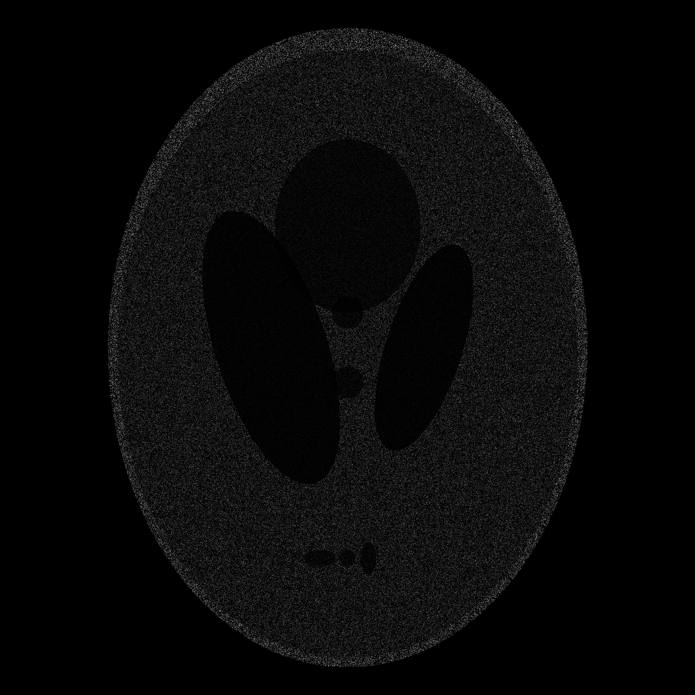
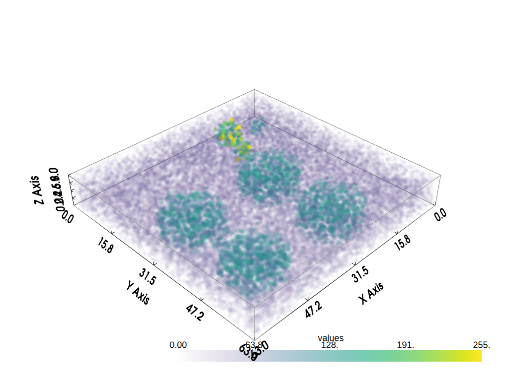

# Phantom generator

This is an utility to generate computational ultrasonic phantoms to be used later for performing simulations.

It receives a json configuration file, containing the desired structures and other parameters, and saves the phantom as a text file, MATLAB(R) mat file and png.

It is possible to generate 2-D and 3-D phantoms. For the 3-D phantoms, the output is generated for each Z-slice and, if configured, generates a final mat file with the 3-D phantom. There is also a separate script (`plot_3d_phantom.py`) that displays the 3-D phantom and save a screenshot as svg image.

## Package requirements

The application was developed with Python 3.9.4 and tested with the following versions of packages:

* matplotlib 3.4.2
* scipy 1.6.3
* numpy 1.20.3
* pyvista 0.33.2
* psutil 5.8.0
* pydicom 2.3.0

They can be installed with `pip install -r requirements.txt`, but a version is not specified. It is possible that the modules have dependencies incompatibilities in more recent versions of Python (e.g 3.10).

### Documentation

Doxygen and Graphviz are used for documentation. AsciiDoc is used for the software requirements documentation.

## Usage

### Generating a phantom

Usage: `generate_phantom.py [-h] -c CONFIG -f FORMAT -o OUTPUT_NAME [-v VERBOSITY]`

Optional arguments:

  **-h, --help** Show the help message and exit

Required named arguments:

  **-c CONFIG, --config CONFIG** Specify the input json configuration file. Use forward slashes to specify a path. Example: ../config.json

  **-f FORMAT, --format FORMAT** Define in which format the phantom will be saved. Any combination of the following three options are possible: t - save in a text file; m - save in a .mat file; p - save a png image

  **-o OUTPUT_NAME, --output_name OUTPUT_NAME** Name of the output files (txt, mat and png). If a directory is used as input, this will be the subdirectory name

Optional arguments:

  **-v VERBOSITY, --verbosity VERBOSITY** Enables verbose output. Values: 'on' and 'off' (without quotes)

Example:

```
python generate_phantom.py -c examples/example_shepp_logan.json -f p -o example_shepp_logan_phantom
```



Example of json configuration file. The 'examples' folder contains json samples for all supported formats. Note that the attributes below are mandatory:

```json
    {
        "rows_y":512,
        "cols_x":512,
        "distribution":"uniform",
        "perc_of_scatterers":80,
        "phantom_format":"k_wave",
        "structures": [
            { "type":"circle", "center_xy":[ 300, 300 ], "radius":50, "scat_gain":3 },
            { "type":"rectangle", "top_left_corner_xy":[ 50, 60 ], "length_x":20, "length_y":30, "scat_gain":4 },
            { "type":"free_polygon", "vertices_xy":[ [100, 100], [200, 100], [200, 200] ], "scat_gain":0 },
            { "type":"points", "coordinates_xy":[ [80, 90], [85, 85] ], "scat_gain":2 }
        ]
    }
```

Alternatively, an image can be used as input, but only for effective scatterers format. Example:

```json
    {
    "distribution":"rayleigh",
    "perc_of_scatterers":60,
    "phantom_format":"effec_scatterers",
    "image_path":"../input_image.bmp"
    }
```

The image can also be in DICOM format. For this, it is only necessary to specify a file with .dcm extension. Example:

```json
    {
    "distribution":"rayleigh",
    "perc_of_scatterers":60,
    "phantom_format":"effec_scatterers",
    "image_path":"../input_image.dcm"
    }
```

There are two supported phantom formats: `"effec_scatterers"` that generates a 2-D phantom and `"k_wave"` that generates a 3-D phantom along with sound speed and density maps so it can be used to run simulations with k-Wave toolboxes.

If phantom format is set to "k_wave" the following attributes need to be set as well:

```json
  "depth_z"
  "sound_speed_c0_m_per_s"
  "density_rho0_kg_per_m3"
```

### Supported structures

Structures supported for 2-D and 3-D phantoms. Note: for 3-D phantoms, these structures are replicated in every slice.

* Circle
* Ellipse
* Polygon
* Single point
* Rectangle

Only for 3-D phantoms:

* Sphere

### Plotting a 3-D phantom

It is possible to plot the 3-D phantom based on the final .mat file. An svg file named with array name and the timestamp is also generated.

The `plot_3d_phantom.py` script is used for this:

Usage: `plot_3d_phantom.py [-h] -a ARRAY_NAME -f FILE_NAME [-m COLOR_MODE]`

Optional arguments:

  **-h, --help** Show the help message and exit

Required named arguments:

  **-a ARRAY_NAME, --array_name ARRAY_NAME** The internal array name stored in the .mat file

  **-f FILE_NAME, --file_name FILE_NAME** Path of the 3-D mat file containing the phantom data

Optional arguments:

  **-m COLOR_MODE, --color_mode COLOR_MODE** Options are 'light' and 'dark', without quotes

Example:

```
python plot_3d_phantom.py -a phantom -f examples/example_3d.mat -m light
```




## Software requirements

The *requirements* folder contains the software requirements used for creating the application.

## Contributing

### Coding guidelines

Follow the current style.

### Adding code

Just create an issue and open a pull request.
